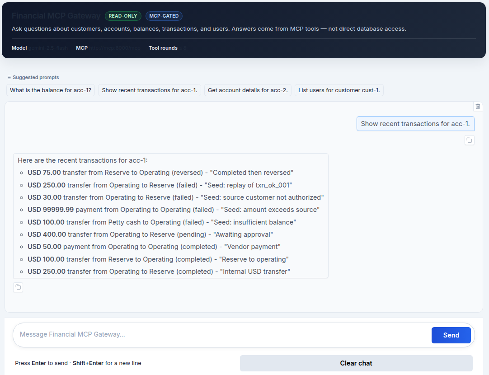

# Financial MCP Gateway

Read-only reference implementation of the [MCP 2026-07-28 specification](https://modelcontextprotocol.io/specification/2026-07-28) applied to a financial domain. Demonstrates Streamable HTTP transport, stateless server configuration, structured tool outputs, and clear agent/domain boundaries.

> **Principle:** MCP is the capability boundary between the agent and the financial system. The agent receives only what the tools expose — nothing more.

---

## Demo



*The Gradio chat UI querying recent transactions via the MCP gateway. Answers are grounded in MCP tool results — the agent never accesses the database directly.*

---

## Architecture

```text
User
  ↓
LLM / Agent  (Gemini 2.5 Flash)
  ↓
MCP Client   client.py
  ↓  HTTP POST /mcp
MCP Server   server.py — Streamable HTTP, stateless
  ↓
MCP Tools    mcp/
  ↓
Domain Services
  ↓
SQLite
```

The REST API (`src/financial_mcp_gateway/api/router.py`, port 8080) and MCP layer share the same domain services but serve different consumers. The agent has no direct path to domain services or the database.

---

## MCP Tools

All tools are read-only.

| Tool | Description |
|------|-------------|
| `get_customer` | Customer by ID |
| `get_account` | Account details |
| `get_account_balance` | Balance, status, and transaction count |
| `get_transaction` | Single transaction |
| `list_transactions` | Recent transactions for an account |
| `get_transaction_summary` | System-wide transaction counts by status |
| `get_user` | User by ID |
| `list_users` | Users for a customer |
| `get_idempotency_key` | Idempotency key lookup |

---

## Quick Start

Requires Docker and a [Gemini API key](https://aistudio.google.com/apikey).

```bash
git clone https://github.com/habeneyasu/financial-mcp-gateway.git
cd financial-mcp-gateway
cp .env.example .env   # add GEMINI_API_KEY
docker compose up --build
```

| Service | URL |
|---------|-----|
| MCP | http://127.0.0.1:8000/mcp |
| Chat UI | http://127.0.0.1:8001/ |
| REST API | http://127.0.0.1:8080/docs |

### Local (uv)

Requires Python 3.12+, [uv](https://docs.astral.sh/uv/), and a Gemini API key.

```bash
uv sync
cp .env.example .env

uv run python server.py      # MCP   → http://127.0.0.1:8000/mcp
uv run python chat_app.py    # Chat  → http://127.0.0.1:8001/
```

### Try it

```bash
curl -s -X POST http://127.0.0.1:8001/chat \
  -H 'Content-Type: application/json' \
  -d '{"message": "What is the balance for acc-1?"}'
```

```python
# Direct MCP client — no Gemini
import asyncio
from client import connect

async def main():
    async with connect() as gateway:
        result = await gateway.call_tool("get_account_balance", {"account_id": "acc-1"})
        print(result.structured_content)

asyncio.run(main())
```

---

## Demo Data

| Resource | IDs |
|----------|-----|
| Customers | `cust-1` … `cust-5` |
| Accounts | `acc-1`, `acc-2`, `acc-empty` |
| Transactions | `txn_ok_001`, `txn_pending_001`, `txn_fail_nsf_001` |
| Users | `user-1`, … |

SQLite is seeded automatically on first startup.

---

## Guardrails

- Input validated with Pydantic; prompt-injection patterns blocked before Gemini is called
- Agent tool loop capped at `AGENT_MAX_TOOL_ROUNDS` (default 8)
- No mutation tools — MCP exposes only read-only tools.

This is a reference demo, not production banking infrastructure.

---

## Project Layout

```text
server.py          MCP server (Streamable HTTP)
client.py          MCP client
chat_app.py        Gradio chat UI + /chat API
config.py          Configuration
db.py              SQLite schema and seed data
src/financial_mcp_gateway/
  agent/           Gemini agent loop — MCP client only, no domain imports
  mcp/             MCP tool handlers
  accounts/        Account domain
  customers/       Customer domain
  transactions/    Transaction domain
  users/           User domain
  idempotency/     Idempotency domain
  api/             REST API
```

---

## Development

```bash
uv run pytest
```

New financial capabilities follow this pattern:

```text
Domain Service → MCP Tool → tools/list → Agent discovers → tools/call
```

See [AGENTS.md](./AGENTS.md) for architectural guidance for AI-assisted development.
