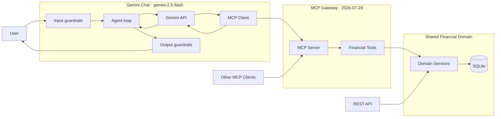

# Financial MCP Gateway

> Give AI agents financial capabilities without giving them the keys to the system.

Financial systems already expose APIs. Agents raise a different question: **how do you grant access to capabilities without granting access to the system?**

**Principle:** Put MCP between the agent and the financial domain.

Read-only reference implementation targeting the [MCP 2026-07-28 specification](https://modelcontextprotocol.io/specification/2026-07-28) — Streamable HTTP, structured tool inputs and outputs, and a small financial domain (customers, accounts, transactions, users).

---

## Why this matters

Without an explicit boundary, an agent often inherits whatever the backend can do — frequently more than intended.

MCP standardizes how capabilities are exposed: named tools, typed arguments, and structured responses. **This gateway** implements that boundary as the enforcement point for agent access — what tools exist, what they accept, and what they return. Domain services own business logic; the MCP surface owns agent access.

The same domain services power MCP, REST, and chat. Only the agent path routes through MCP.

---

## Flow

Chat path (default model: **`gemini-2.5-flash`**, configurable via `GEMINI_MODEL`):

```text
User
  → Input guardrails (Pydantic + policy checks)
  → Agent orchestration
  → Gemini API (tool selection / reply)
  → MCP Client (tools/list → tools/call)
  → MCP Server → Tools → Domain Services → SQLite
  → tool results → Gemini
  → Output guardrails
  → User
```

Gemini **selects** tools; the **MCP client invokes** them. Gemini never imports domain code or queries SQLite.

On the MCP server: `initialize` → `tools/list` → `tools/call`.

Direct MCP clients skip Gemini and call the server themselves.

---

## Architecture

Three interfaces, one shared domain:

| Interface | Role |
|-----------|------|
| **MCP** | Agents and MCP clients — `http://127.0.0.1:8000/mcp` |
| **REST** | Traditional integrations, same domain services — port 8080 (optional) |
| **Gemini Chat** | Gradio + `/chat`; **Gemini** (`gemini-2.5-flash`) selects tools, **MCP client** invokes them — `http://127.0.0.1:8001/` |



---

## MCP Tools

All tools are **read-only** (no transfers, payments, or withdrawals).

| Tool | Description |
|------|-------------|
| `get_customer` | Get a customer |
| `get_account` | Get account information |
| `get_account_balance` | Get account balance and summary |
| `get_transactions` | Get recent transactions for an account |
| `get_transaction_summary` | Get total transaction count and counts by status |
| `get_transaction` | Get a transaction |
| `get_user` | Get a user |
| `list_users` | List users |

---

## Guardrails

Enforced in code (`agent/schema.py`) and guided in the system prompt (`agent/prompts.py`). **Prompts are not a security boundary on their own.**

### Input

- Pydantic validation on `POST /chat`: message length ≤ 4,000 chars; history capped at 50 turns
- Blocks prompt-injection patterns (instruction override, credential exfiltration requests)
- Empty or invalid input returns `status: "blocked"` without calling Gemini

### Output

- Normalizes Gemini replies into `ChatResponse`
- Truncates replies over 4,000 chars
- Fallback message when the model returns empty text

### Agent loop

- `AGENT_MAX_TOOL_ROUNDS` (default **8**) caps tool-selection rounds per request
- Read-only scope and “no guessing” behavior in the system prompt — financial facts must come from MCP tool results

---

## Quick Start

### Docker Compose (all services)

Requires Docker and `GEMINI_API_KEY` in `.env`:

```bash
git clone <repo-url>
cd financial-mcp-gateway
cp .env.example .env   # set GEMINI_API_KEY
docker compose up --build
```

| Service | URL |
|---------|-----|
| MCP | http://127.0.0.1:8000/mcp |
| Chat | http://127.0.0.1:8001/ |
| REST | http://127.0.0.1:8080/docs |

Stop: `docker compose down`. Persisted SQLite data: `gateway-data` volume.

### Local (uv)

Requires Python 3.14+, [uv](https://docs.astral.sh/uv/), and a Gemini API key.

```bash
git clone <repo-url>
cd financial-mcp-gateway
uv sync
cp .env.example .env   # set GEMINI_API_KEY

# Terminal 1 — MCP server (http://127.0.0.1:8000/mcp)
uv run python server.py

# Terminal 2 — chat UI (http://127.0.0.1:8001/)
uv run python chat_app.py

# Optional — REST API (http://127.0.0.1:8080/docs)
uv run uvicorn financial_mcp_gateway.api.router:app --host 0.0.0.0 --port 8080
```

Example prompt: `What is the balance for acc-1?`

```bash
# Chat API
curl -s -X POST http://127.0.0.1:8001/chat \
  -H 'Content-Type: application/json' \
  -d '{"message":"What is the balance for acc-1?"}'
```

```python
# Direct MCP client (no Gemini)
import asyncio
from client import connect

async def main():
    async with connect() as gateway:
        result = await gateway.call_tool("get_account_balance", {"account_id": "acc-1"})
        print(result.structured_content)

asyncio.run(main())
```

---

## Demo Data

| Resource | Examples |
|----------|----------|
| Customers | `cust-1` … `cust-5` |
| Accounts | `acc-1`, `acc-2`, `acc-empty` |
| Transactions | `txn_ok_001`, `txn_pending_001`, `txn_fail_nsf_001` |
| Users | `user-1`, … |

Database is seeded on MCP server or REST startup.

---

## Security

Reference demo — not production banking. Includes read-only tools, structured contracts, input/output validation, bounded tool loops, and static scanning via `mcp_guard.py`.

```bash
uv run python mcp_guard.py . --fail-on high
```

See [MCP_SECURITY.md](./MCP_SECURITY.md) for rules and hardening guidance.

**Production note:** auth, TLS, rate limiting, audit logging, and multi-tenant isolation are not implemented in this demo.

---

## Project Layout

```text
server.py          MCP server
client.py          MCP client
chat_app.py        Gemini chat
mcp_guard.py       Security scanner
src/financial_mcp_gateway/
  agent/           Gemini agent loop (MCP client only)
  mcp/             Tool handlers
  */               Domain modules (accounts, customers, …)
  api/router.py    REST API
```

---

## Contributing

When extending this project, preserve the core principle:

> **Agents interact with the financial domain through explicit MCP capabilities — not through direct access to domain services or the database.**

Keep tools narrow and structured. Run `mcp_guard.py` before submitting changes.
